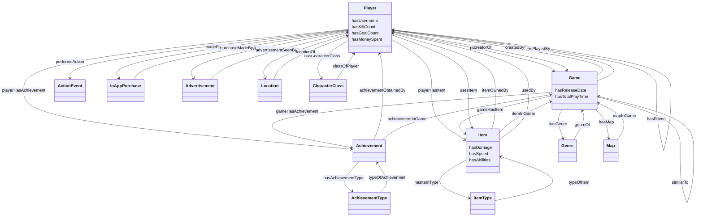

`


```mermaid
classDiagram

    
    class Player {
    
    }

    class Game {
    
    }

    class Achievement {
    
    }

    class Item {
    
    }

    class Genre {
    
    }

    class Map {
    
    }

    class ActionEvent {
    
    }

    class InAppPurchase {
    
    }

    class Advertisement {
    
    }

    class Location {
    
    }

    class CharacterClass {
    
    }

    class AchievementType {
    
    }

    class ItemType {
    
    }


    

Player  --> Player   :hasFriend  

Player  --> Game   :plays  

Player  --> Achievement   :playerHasAchievement  

Game  --> Achievement   :gameHasAchievement  

Player  --> Item   :playerHasItem  

Game  --> Item   :gameHasItem  

Game  --> Genre   :hasGenre  

Game  --> Map   :hasMap  

Game  --> Player   :createdBy  

Game  --> Game   :similarTo  

Player  --> Item   :usesItem  

Player  --> InAppPurchase   :madePurchase  

Player  --> Advertisement   :sawAdvertisement  

Player  --> Location   :livesIn  

Player  --> CharacterClass   :hasCharacterClass  

Achievement  --> AchievementType   :hasAchievementType  

Item  --> ItemType   :hasItemType  

Player  --> ActionEvent   :performsAction  

Game  --> Player   :isPlayedBy  

Achievement  --> Player   :achievementObtainedBy  

Achievement  --> Game   :achievementInGame  

Item  --> Player   :itemOwnedBy  

Item  --> Game   :itemInGame  

Genre  --> Game   :genreOf  

Map  --> Game   :mapInGame  

Player  --> Game   :creatorOf  

Item  --> Player   :usedBy  

InAppPurchase  --> Player   :purchaseMadeBy  

Advertisement  --> Player   :advertisementSeenBy  

Location  --> Player   :locationOf  

CharacterClass  --> Player   :classOfPlayer  

AchievementType  --> Achievement   :typeOfAchievement  

ItemType  --> Item   :typeOfItem  

    
    class Player  {
    
    
        hasUsername  
     
        hasKillCount  
     
        hasGoalCount  
     
        hasMoneySpent  
     
    } 
    
    class Game  {
    
    
        hasReleaseDate  
     
        hasTotalPlayTime  
     
    } 
    
    class Item  {
    
    
        hasDamage  
     
        hasSpeed  
     
        hasAbilities  
     
    }
`
```

```

```
