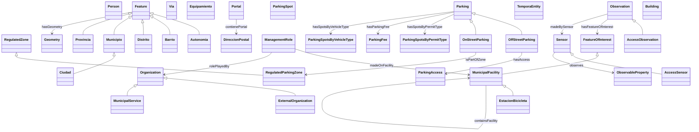

`


```mermaid
classDiagram

    
    class Person {
    
    }

    class EstacionBicicleta {
    
    }

    class RegulatedParkingZone {
    
    }

    class RegulatedZone {
    
    }

    class Autonomia {
    
    }

    class Barrio {
    
    }

    class Ciudad {
    
    }

    class Distrito {
    
    }

    class Municipio {
    
    }

    class Provincia {
    
    }

    class Portal {
    
    }

    class Via {
    
    }

    class DireccionPostal {
    
    }

    class Equipamiento {
    
    }

    class AccessObservation {
    
    }

    class AccessSensor {
    
    }

    class ExternalOrganization {
    
    }

    class ManagementRole {
    
    }

    class MunicipalFacility {
    
    }

    class MunicipalService {
    
    }

    class OffStreetParking {
    
    }

    class OnStreetParking {
    
    }

    class Organization {
    
    }

    class Parking {
    
    }

    class ParkingAccess {
    
    }

    class ParkingFee {
    
    }

    class ParkingSpot {
    
    }

    class ParkingSpotsByPermitType {
    
    }

    class ParkingSpotsByVehicleType {
    
    }

    class Feature {
    
    }

    class Geometry {
    
    }
    class TemporaEntity {
    
    }

    class FeatureOfInterest {
    
    }

    class ObservableProperty {
    
    }

    class Observation {
    
    }

    class Sensor {
    
    }

    class Building {
    
    }


    
    MunicipalFacility <|-- EstacionBicicleta 
    
    Parking <|-- OffStreetParking 
    
    RegulatedZone <|-- RegulatedParkingZone 
    
    Feature <|-- Autonomia 
    
    Feature <|-- Barrio 
    
    Feature <|-- Distrito 
    
    Feature <|-- Municipio 
    
    Feature <|-- Provincia 
    
    Municipio <|-- Ciudad 
    
    Observation <|-- AccessObservation 
    
    Sensor <|-- AccessSensor 
    
    Organization <|-- ExternalOrganization 
    
    Organization <|-- MunicipalService 
    
    FeatureOfInterest <|-- MunicipalFacility 
    
    Parking <|-- OnStreetParking 
    
    

Portal  --> DireccionPostal   :contienePortal  

Parking  --> ParkingSpotsByPermitType   :hasSpotsByPermitType  

OnStreetParking  --> RegulatedParkingZone   :isPartOfZone  

MunicipalFacility  --> MunicipalFacility   :containsFacility  

OffStreetParking  --> ParkingAccess   :hasAccess  

Parking  --> ParkingFee   :hasParkingFee  

Parking  --> ParkingSpotsByVehicleType   :hasSpotsByVehicleType  

ManagementRole  --> MunicipalFacility   :madeOnFacility  

ManagementRole  --> Organization   :rolePlayedBy  

Feature  --> Geometry   :hasGeometry  

Observation  --> FeatureOfInterest   :hasFeatureOfInterest  

Observation  --> Sensor   :madeBySensor  

Sensor  --> ObservableProperty   :observes
`
```

```

```
