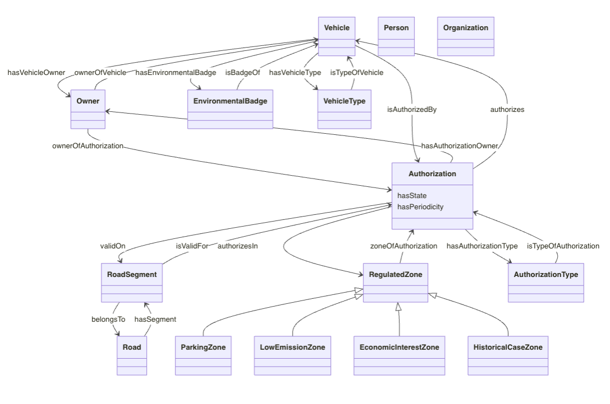
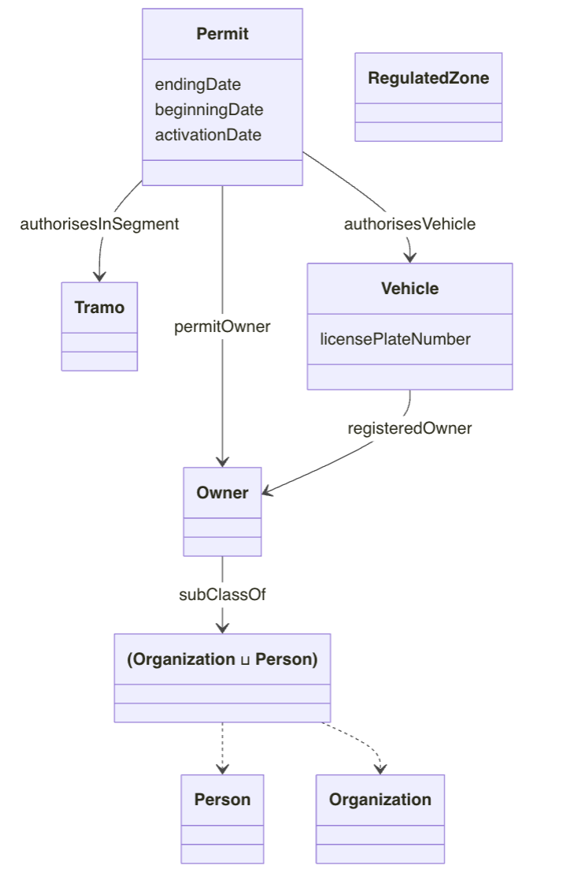

## Generated Ontology Evaluation

We evaluate MASEO framework across two complementary dimensions in three ontology generation case studies: Infrastructure Ontology, Vehicle Census Ontology (VCO), and Video Game Ontology (VGO).
1. **Structural characteristics & CQ coverage**: The first dimension combines structural analysis and CQ requirement coverage. Structural characteristics are derived from ontology diagrams, while CQ coverage is assessed from provenance records through expert inspection.
2. **Concept label matching & concept coverage**: The second dimension evaluates the alignment between concept labels in the generated ontologies and those in the corresponding gold-standard ontologies. We assess this alignment using three matching strategies, namely exact match, lexical match, and semantic match, and report precision, recall, F1-score, and concept coverage for each strategy.

### Evaluation Datasets Selection

| Dataset | Language | CQs | Gold Standard |
|---|---|---:|---|
| Infrastructure Ontology | Spanish | 5 | [Gold_Infrastructure.owl](https://github.com/oeg-upm/maseo/blob/main/dataset/gold_standard_ontology/Gold_Infrastructure.owl) |
| Vehicle Census Ontology (VCO) | Spanish | 28 | [Gold_VCO.owl](https://github.com/oeg-upm/maseo/blob/main/dataset/gold_standard_ontology/Gold_VCO.owl) |
| Video Game Ontology (VGO) | English | 68 | [Gold_VGO.owl](https://github.com/oeg-upm/maseo/blob/main/dataset/gold_standard_ontology/Gold_VGO.owl) |

### Evaluation Perspectives

#### Structural Analysis

To compare the structural characteristics (e.g., number of classes, object properties, datatype properties, and hierarchy structure) for ontologies, visualization of the ontology is adopted to conduct the analysis. In this project, we have adopted `owl2diagram` to generate the diagrams.


#### CQ Coverage

The proportion of input CQs that can be traced to at least one ontology element through provenance records. Therefore, we adopted CQ coverage to evaluate how many CQs are actually used in the ontology. Here is the calculation process of the CQ Coverage. 
```math
CQCoverage = \frac{|Q_{covered}|}{|Q_{input}|}
```

#### Concept Label Matching

Concept label matching evaluates whether a concept label in the generated ontology can be aligned with a concept label in the corresponding gold-standard ontology.

To assess concept label alignment, we adopt three matching strategies:

- **Exact match**: labels are considered matched only when they are character-for-character identical.
- **Lexical match**: labels are matched based on character-level similarity using `SequenceMatcher` from the `difflib` library.
- **Semantic match**: labels are matched based on embedding cosine similarity using `embeddinggemma`, hosted locally via the Ollama runtime environment.


| Strategy | Method | Tool |
|---|---|---|
| Exact | String equality | — |
| Lexical | Character-level similarity | `difflib.SequenceMatcher` |
| Semantic | Embedding cosine similarity | `embeddinggemma` via Ollama |

The calculation process of Precision, recall, and F1-score is given here:

```math
P=\frac{TP}{TP+FP}, \quad
R=\frac{TP}{TP+FN}, \quad
F1=\frac{2PR}{P+R}
```

#### Concept Coverage

To further evaluation for concept label mathcing, we adopted **Concept Coverage** to measure how many concepts in gold-standard ontology are matched.

Here is the calculation process for **Concept Coverage**
```math
ConceptCoverage^m = \frac{|C^m_{match}|}{|C_{gold}|}, \quad m \in \{exact, lex, sem\}
```

- `C_gold` is the set of gold-standard concepts
- `C_match^m` is the set of concepts matched under strategy `m`

#### Structural Analysis

Here is the command to generate the diagram for the generated/gold standard ontology:

```bash
python -m owl2diagram \
    dataset/gold_standard_ontology/Gold_VCO.owl \
    gold_VCO.md

python -m owl2diagram \
    dataset/generated_ontology/Gen_VCO.owl \
    gen_VCO.md
```

#### Concept label matching

Here is the command to evaluate the generated ontology to the gold standard ontology. `generate_onto_file_path` refers to the local path to the generated ontology, `ground_onto_file_path` refers to the local path to the gold standard ontology.

```bash
cd evaluation
python eva_.py \
    --generate_onto_file_path ../dataset/generated_ontology/Gen_VCO.owl \
    --ground_onto_file_path   ../dataset/gold_standard_ontology/Gold_VCO.owl
```

### Evaluation Result

#### Structural Analysis

Here is an example of the result of  structural analysis: 

**Vehicle Census Ontology (VCO)**
Generated Ontology:



Gold Standard Ontology:


<!-- 


 -->

The full structural analysis of three ontologies:

| Element | Infrastructure (Gold / Gen) | VCO (Gold / Gen) | VGO (Gold / Gen) |
|---|---:|---:|---:|
| Classes | 37 / 14 | 7 / 15 | 37 / 13 |
| Object Properties | 13 / 12 | 4 / 18 | 32 / 33 |
| Datatype Properties | 0 / 5 | 4 / 2 | 6 / 9 |
| Subclass Relations | 15 / 7 | 1 / 4 | 24 / 0 |
| InverseOf Axioms | 0 / 6 | 0 / 9 | 0 / 15 |
| Linked CQs | 5 / 5 | 28 / 17 | 68 / 37 |
| CQ Coverage | 100.0% | 60.7% | 54.4% |

#### CQ Coverage

| Dataset | Input CQs | Covered CQs | Coverage |
|---|---:|---:|---:|
| Infrastructure | 5 | 5 | 100.0% |
| Vehicle Census (VCO) | 28 | 17 | 60.7% |
| Video Game (VGO) | 68 | 37 | 54.4% |

#### Class Counts Used for Concept Label Matching

| Dataset | Generated Classes | Gold-standard Classes |
|---|---:|---:|
| Infrastructure | 14 | 40 |
| Vehicle Census (VCO) | 15 | 10 |
| Video Game (VGO) | 13 | 37 |


#### Concept Label Matching Results

| Dataset | Strategy | Precision | Recall | F1-score | Coverage |
|---|---|---:|---:|---:|---:|
| Infrastructure | Exact | 0.071 | 0.024 | 0.037 | 0.025 |
| Infrastructure | Lexical | 0.750 | 0.500 | 0.600 | 0.500 |
| Infrastructure | Semantic | 0.667 | 0.750 | 0.705 | 0.605 |
| Vehicle Census (VCO) | Exact | 0.333 | 0.333 | 0.333 | 0.400 |
| Vehicle Census (VCO) | Lexical | 0.733 | 0.643 | 0.685 | 0.700 |
| Vehicle Census (VCO) | Semantic | 0.708 | 0.846 | 0.772 | 0.846 |
| Video Game (VGO) | Exact | 0.250 | 0.167 | 0.200 | 0.135 |
| Video Game (VGO) | Lexical | 0.690 | 0.735 | 0.712 | 0.676 |
| Video Game (VGO) | Semantic | 0.924 | 0.712 | 0.804 | 0.712 |