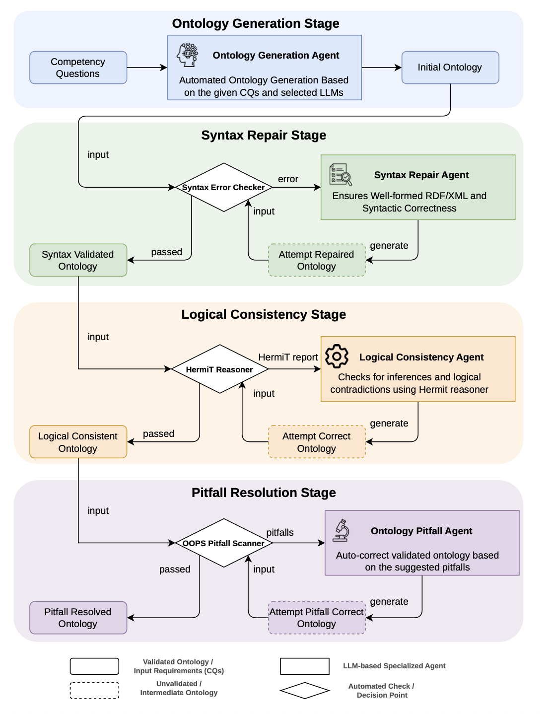

# MASOE Execution Instruction

A fully automated, multi-agent pipeline that generates OWL ontologies directly from Competency Questions (CQs) and iteratively repairs them using external validation tools. Every ontology term produced by the pipeline is traceable to the agent and requirement that introduced it.

---

## MASOE Structural Overview

The pipeline consists of four sequential stages:

| Agent | Model | Responsibility |
|-------|-------|----------------|
| `Ontology Generation Agent` | `deepseek-reasoner` | Generates the initial OWL ontology from CQs |
| `Syntax Repair Agent` | `deepseek-reasoner` | Fixes RDF/XML syntax errors reported by the parser |
| `Logical Consistency Agent` | `deepseek-reasoner` | Repairs logical inconsistencies reported by HermiT |
| `Pitfall Resolution Agent` | `deepseek-reasoner` | Resolves ontology modeling pitfalls reported by OOPS! |

The illustration of the MASOE framework:



---

## Features

- **End-to-end automation** — from a list of CQs to a validated ontology
- **Role-based agents** — each stage is handled by a dedicated LLM agent with a specific instruction and responsibility
- **Provenance tracking** — every ontology entity carries an append-only `vaem:rationale` log attributed to the agent that made each change, and a `dc:source` log linking each change back to the CQ, pitfall, or error that motivated it

---

## Requirements

### Python dependencies

```bash
pip install agno rdflib requests beautifulsoup4 pydantic
```

### External tools

| Tool | Purpose | Setup |
|------|---------|-------|
| [HermiT Reasoner](http://www.hermit-reasoner.com/) | Logical consistency checking | Download `HermiT.jar` and update the path in `reason_ontology()` |
| [OOPS! REST API](https://oops.linkeddata.es/) | Ontology pitfall detection | No local setup required — uses the public REST endpoint |
| Java (JRE 8+) | Required to run HermiT | `sudo apt install default-jre` |

---

## Configuration

Before running, update the following constants at the top of `agent_framework.py`:

```bash
# Instaill java and ollama in you system
sudo apt update
sudo apt install deflault-jre
sudo apt install curl
curl -fsSL https://ollama.com/install.sh | sh
ollama pull embeddinggemma
ollama serve
```
Make the changes in the `agent_framework.py` to ensure the correctness of variables. 
```python

# Path to your OOPS! request template
REQUEST_TEMPLATE = "/path/to/oops_request_template.xml"

# Path to HermiT JAR inside reason_ontology()
"java", "-jar", "/path/to/HermiT.jar"
```
---

## Usage

```bash
python agent_framework.py \
    --api_key      YOUR_DEEPSEEK_API_KEY \
    --cqs_file     path/to/competency_questions.json \
    --save_file    path/to/output_ontology.owl \
    --agent_method true
```

### Arguments

| Argument | Required | Description |
|----------|----------|-------------|
| `--api_key` | Yes | DeepSeek API key |
| `--cqs_file` | Yes | Path to a JSON file containing the list of competency questions |
| `--save_file` | Yes | Path where the final OWL ontology will be saved |
| `--agent_method` | No | `true` runs the full 4-stage pipeline; `false` runs generation only (default: `false`) |

### CQs file format

The CQs file should be a JSON array of strings:

```json
[
  "What is the genre of a game?",
  "Which players have purchased an in-app item?",
  "What is the username of a player?",
...
]
```

---

## Ontology Entity Structure

Each generated ontology entity is a structured object with the following fields:

| Field | Definition | Example value |
|-------|-----------|---------------|
| **Type** (`rdf:type`) | Indicates whether the entity is an `owl:Class`, `owl:ObjectProperty`, or `owl:DatatypeProperty`. | `:Player rdf:type owl:Class;` `:hasUsername rdf:type owl:DatatypeProperty` |
| **Label** (`rdfs:label`) | Provides a human-readable name for the entity. | `"Player"` ; `"has username"` |
| **Comment** (`rdfs:comment`) | Provides a textual description of the meaning of the entity. | `"A person who plays games."` ; `"Relates a player to the player's username."` |
| **Rationale** (`vaem:rationale`) | Records the justification for entity creation or modification across refinement iterations. | `"Derived from CQ [number] about the username of a player."` |
| **Source** (`dc:Source`) | Records the CQ or validation feedback from which the entity or revision was derived. | `"What is the username of the player?"` |
| **Subclass of** (`rdfs:subClassOf`) | (Classes only) Records subclass relations or logical restrictions involving the class. | `:Player rdfs:SubClassOf :Human` |
| **Domain** (`rdfs:domain`) | (Properties only) Specifies the class to which a property applies. | `:hasUsername rdfs:domain :Player` |
| **Range** (`rdfs:range`) | (Properties only) Specifies the value type or class associated with a property. | `:hasUsername rdfs:range xsd:string` |
| **Other Axioms** | Captures logical constraints as structured XML comments to preserve modeling intent. | `<!-- Axiom: Disjoint with Game -->` (captured as comments) |

### Example output

```xml
<owl:Class rdf:about="http://www.semanticweb.org/myontology#Player">
  <!-- Axiom: disjointWith NPC -->
  <dc:source>CQ1, CQ3; HermiT: conflict; OOPS P10</dc:source>
  <vaem:rationale>
    [Logical Consistency Agent] Fixed subClassOf error;
    [Ontology Pitfall Agent] Added disjointness.
  </vaem:rationale>
  <!-- Axiom: disjointWith NPC -->
</owl:Class>

<owl:ObjectProperty rdf:about="http://www.semanticweb.org/myontology#triggersEvent">
  <rdfs:domain rdf:resource="http://www.semanticweb.org/myontology#Player"/>
  <rdfs:range rdf:resource="http://www.semanticweb.org/myontology#GameEvent"/>
  <dc:source>HermiT: introduced to resolve Player unsatisfiability</dc:source>
  <vaem:rationale>[Logical Consistency Agent] Created to correctly model player-event relationship.</vaem:rationale>
</owl:ObjectProperty>
```


